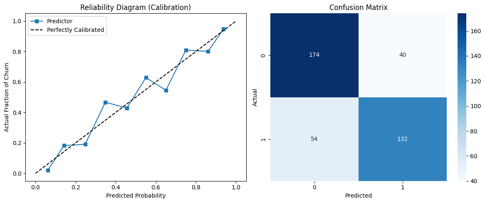
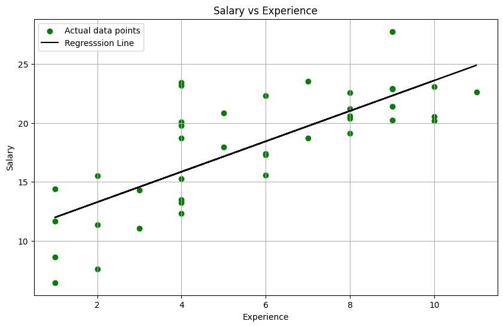
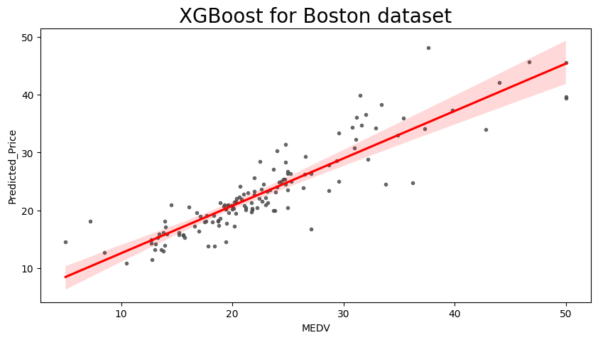
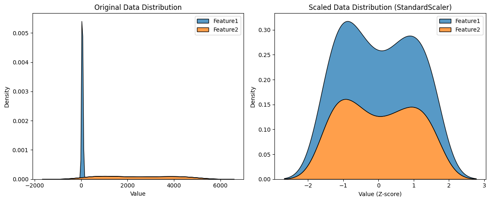
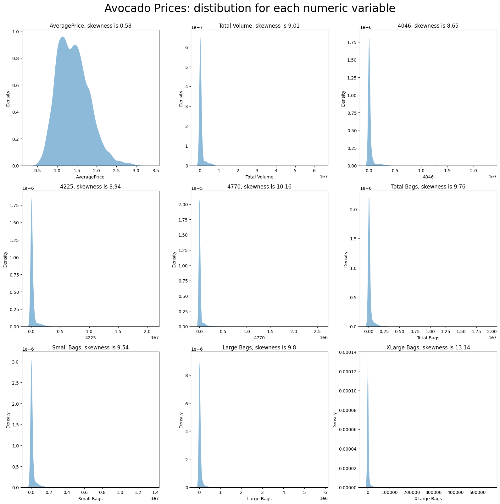

# ML_Learning_Projects
My Journey through Machine Learning: Projects covering ML fundamentals, regression, classification, EDA, and advanced pipelines using Python, Pandas, and Scikit-learn.


# Machine Learning Engineering Journey

### From Fundamentals to Production-Style Pipelines

This repository documents my **2-week intensive hands-on learning sprint** in Machine Learning.
The focus was not just learning theory, but writing **clean, modular, and professional code** with clear explanations and reproducible workflows.

---

## Project Goals

* Build strong foundations in Python for Data Science
* Perform Exploratory Data Analysis on real datasets
* Understand Regression and Classification deeply
* Learn how real ML pipelines are structured
* Implement hyperparameter tuning and modular pipelines

---

## 📈 Example Visualizations



## 📊 Key Visualizations

| Rating Distribution | Pricing Strategy |
|--------------------|----------------|
|  |  |

| Heatmap | Wordcloud |
|---------|-----------|
|  |  |


---

## Repository Structure

```
ML-Learning-Projects/

01_Python_Foundations/
    1_DataStructures.py
    2_Numpy.py
    3_Pandas.py
    4_DataCleaning.py
    5_Matplotlib.py

02_EDA_Projects/
    6_EDAProject.py
    7_AmazonSalesEDA.py

03_ML_Fundamentals/
    8_MLfundamentals.ipynb
    9_RegressionFundamentals.ipynb
    10_RegressionModels.ipynb
    11_ClassificationFundamentals.ipynb
    12_ClassificationModels.ipynb

04_Advanced_Pipelines/
    13_HyperparameterTunningMLpipeline.py
    14_ProfessionalGradeClassificationModel.ipynb

data/
    amazon.csv
    avacado.csv
    housing.csv

img/Graphs
requirements.txt

```

---

## Learning Roadmap

This project follows a structured progression:

1. Python & Data Handling
2. Data Cleaning & Visualization
3. Exploratory Data Analysis
4. Machine Learning Concepts
5. Model Training & Evaluation
6. Hyperparameter Tuning
7. Modular ML Pipelines

---

## Key Skills Demonstrated

* Data preprocessing and cleaning
* Feature engineering
* Regression and classification models
* Model evaluation metrics
* Hyperparameter tuning
* Pipeline design
* Code modularity and readability
* Documentation practices

---

## Tools & Libraries

* Python
* NumPy
* Pandas
* Matplotlib
* Scikit-learn
* Jupyter Notebook

---

## How to Run

Clone the repository:

```
git clone https://github.com/avotorworkscoder/ML_Learning_Projects.git
cd ML_Learning_Projects
```

Install dependencies:

```
pip install -r requirements.txt
```

Run Python scripts or open notebooks using VS Code or Jupyter.

---

## Key Takeaways From This Sprint

* Importance of clean data before model training
* How visualization reveals patterns faster than statistics alone
* Why modular pipelines scale better than monolithic scripts
* How hyperparameter tuning improves real-world performance

---

## About Me

I am a **Mechatronics engineer specializing in Robotics and AI/ML**, currently building projects that combine:

* Machine Learning
* Robotics
* Automation
* Real-world engineering systems

This repository is part of my journey toward **production-level ML engineering and intelligent systems**.

---

## Future Improvements

* Add deployment examples
* Add deep learning pipelines
* Add real-time inference systems
* Integrate ML with robotics applications

---

## License

This project is for learning and educational purposes.

